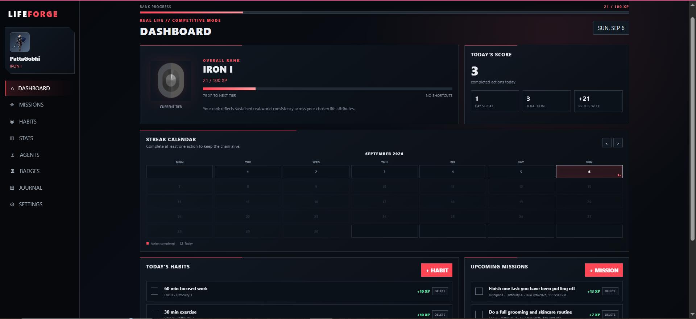
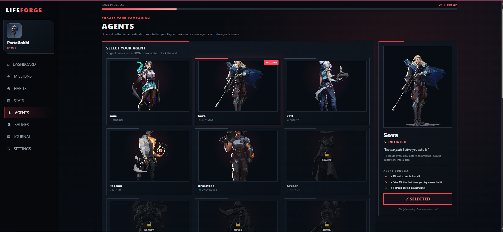
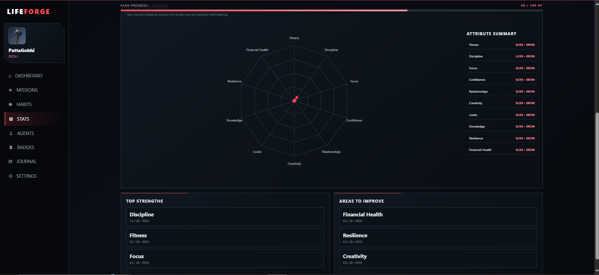

# LIFEFORGE

> A gamified VALORANT-styled personal progression system built through
> AI-assisted vibecoding and prompt engineering.

## 📸 Preview

### Dashboard

### Agents

### Stats

### Journal

## 🧠 Why I Built It

A few weeks ago, I saw a random Instagram ad for a website that turned
personal productivity into a game.

I liked the idea --- until I saw it was paid.

My ego basically said: **"I can build this myself instead of paying for
it."** 😂

So I did.

LIFEFORGE turns real-life tasks and habits into a progression system
inspired by competitive games --- complete missions, earn XP, climb
ranks, unlock achievements, and track your journey.

## 🎮 Features

-   ⚔️ Missions & daily habits
-   ⚡ XP-based progression and competitive-style ranks
-   🏆 Achievements & badges
-   🤖 VALORANT-inspired agent system
-   📓 Personal journal
-   📊 Progress statistics
-   🔐 User authentication
-   ☁️ Cloud-saved progress with Supabase
-   📱 Cross-device synchronization
-   🚀 Deployed on Vercel

## 🤖 AI-Assisted Development

**LIFEFORGE was vibecoded.**

I used AI extensively throughout the development process rather than
manually writing every line of code from scratch.

My main contribution was the **product direction, prompt engineering,
iteration, testing, debugging, and refinement** needed to turn the
initial idea into a working product.

The development process was essentially:

**Prompt → Build → Test → Break → Debug → Refine → Repeat**

This project became a practical experiment in understanding how far
effective prompt engineering and AI-assisted development can take a real
product.

## 🛠️ Tech Stack

-   HTML
-   CSS
-   JavaScript
-   Supabase
-   Vercel

## 🌐 Live Demo

[**Try LIFEFORGE
→**](https://lifeforge-zndx1x3m2-chirag-s-team1.vercel.app/)

## 🚧 Future Plans

LIFEFORGE is still evolving. Future improvements will explore smarter
personalization and eventually the integration of AI and agentic
systems.

------------------------------------------------------------------------

**Built with curiosity, ego, and a lot of prompts.** 🔥
